# Movie Performance Analysis

## Overview

This project analyzes the performance of movies using ROI (Return on Investment), Revenue, and Ratings metrics to guide a new movie studio in making informed decisions about the most profitable genres, budgets, and runtimes. The data is sourced from the im.db SQLite database and a Kaggle dataset that contains comprehensive movie statistics, including financial details, runtime, and ratings.

## Business Understanding


### Business Problem

Your company now sees all the big companies creating original video content and they want to get in on the fun. They have decided to create a new movie studio, but they don’t know anything about creating movies. You are charged with exploring what types of films are currently doing the best at the box office. You must then translate those findings into actionable insights that the head of your company's new movie studio can use to help decide what type of films to create.

### Stakeholder

The primary stakeholder is the new movie studio, aiming to create original movie content and optimize investments by selecting movie types (genres, budgets, and runtimes) that yield the highest financial returns and audience engagement.

### Key Business Questions

1. Which Movie Genres Are the Most Profitable in Terms of ROI and Revenue?
   - Identifying the genres that provide the highest financial returns and audience appeal.
2. How Does Production Budget Impact Movie Success Metrics (Ratings, ROI, and  Revenue)?
   - Exploring how budget size correlates with movie success metrics to optimize spending.
3. How Does Runtime Affect Success Metrics and Viewer Engagement?
   - Investigating whether runtime influences success metrics like ratings and audience engagement (votes).
   - Success Metrics : Revenue, ROI(Return on Investment), Ratings
      * Revenue: Total box-office income (Worldwide gross).
      * ROI:  Worldwide Revenue−Production Budget / Production Budget 
      * Ratings: The average rating a movie receives (provided as a pre-calculated value in the dataset).

## Data Understanding

### Source of Data

1. IMDb : An SQLite database containing movie information, including movie basics, directors, ratings, and people involved in movie production.
   - Tables : movie_basics, directors, movie_ratings, persons, principals, movie_akas, and more.
    * `im.db.zip` : Zipped SQLite database (you will need to unzip then query using SQLite)
    * `movie_basics` and `movie_ratings` tables are most relevant


2. Kaggle dataset: The dataset from Kaggle offers additional movie statistics.
   - This dataset provides comprehensive movie statistics compiled from multiple sources, including Wikipedia, The Numbers, and IMDb.

### Description of Data

1. **'movie_title'**: The title of the movie.
2. **'production_budget'**: The production budget.
3. **'Worldwide_gross $'**: Total revenue worldwide.
4. **'Domestic_gross $'**: Total revenue in domestic markets.
5. **'runtime_minutes'**: Movie duration.
6. **'genres'**: Movie genres.
7. **'average_rating'**: IMDb average rating.
8. **'number_of_votes'**: Number of votes/reviews on IMDb.

### Data Cleaning and Transformation 

1. Merged data from im.db and Kaggle based on common fields.
2. Addressed missing values by imputation or removal.
3. Split the genres column to handle movies with multiple genres.
4. Eliminated duplicate entries to ensure accuracy.
5. To determine the most profitable genres, we calculated both the ROI and Revenue for each genre.
6. We examined the correlation between production budget and success metrics (i.e., revenue, ROI, and ratings). And a regression analysis was performed to investigate how budget affects both revenue and ROI.
7. The relationship between movie runtime and viewer engagement (votes, ratings) and revenue was explored to identify whether longer movies tend to perform better. And we conducted a t-test to compare the impact of short vs. long runtimes on revenue and audience engagement.

## Analysis and Visualizations

Top 10 Movies by ROI : Horror and Thriller movies, which generally have lower production budgets, consistently deliver the highest ROI.

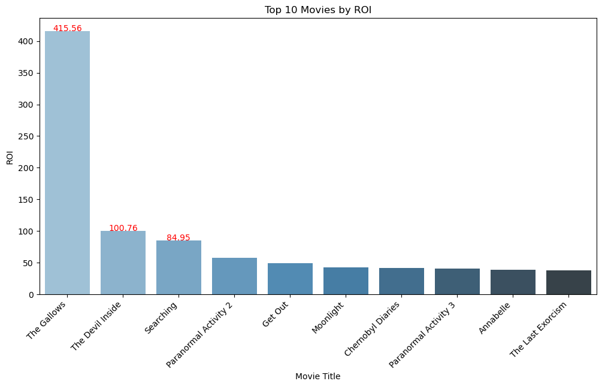

Average ROI by Genre : Horror, Thriller, and Comedy genres deliver the highest ROI, while genres like Action and Adventure tend to have lower ROI but higher revenue.

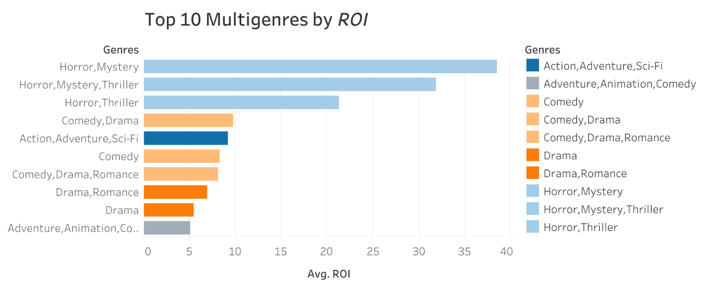

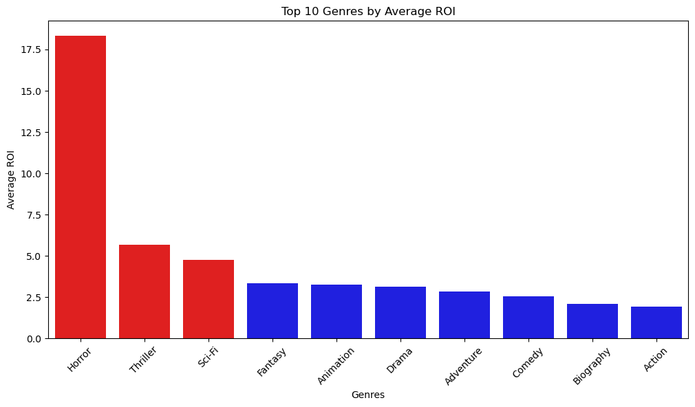

Revenue by Genre : Action, Adventure, and Sci-Fi genres generate the highest revenue, indicating that these genres are ideal for high-budget, global releases.

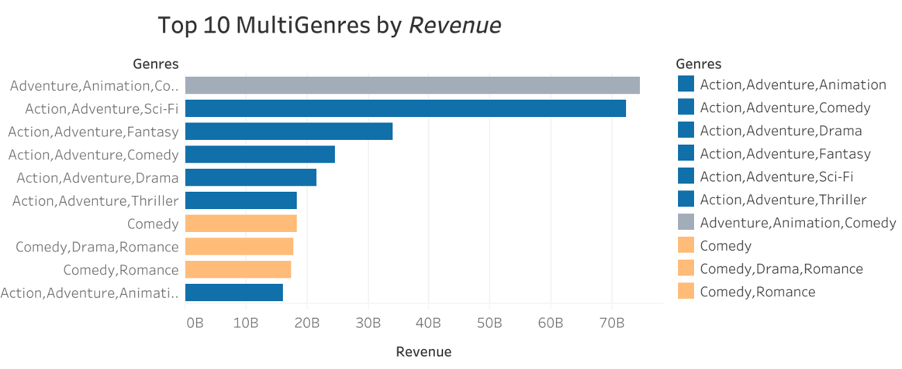


Budget Correlation with Revenue : There is a strong positive correlation between budget and revenue.

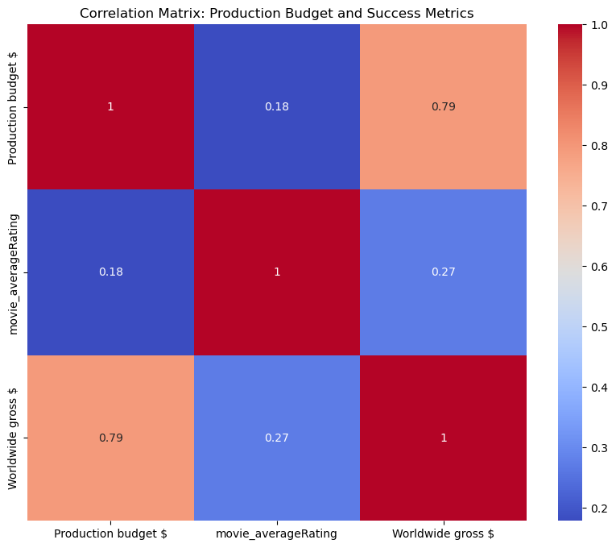

Budget vs. Worldwide Gross Revenue : Movies with larger budgets tend to generate significantly more revenue. 

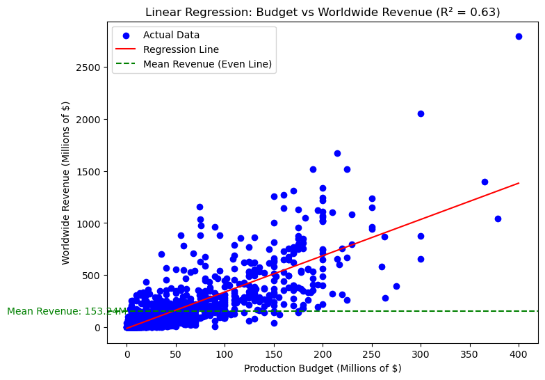

Budget Range Per Genre : Action and Adventure films have the largest budget ranges, with budgets spanning from $40M to $160M, whereas lower-budget genres like Horror and Thriller typically have budgets between $5M and $20M, highlighting the significant budget disparity across genres.

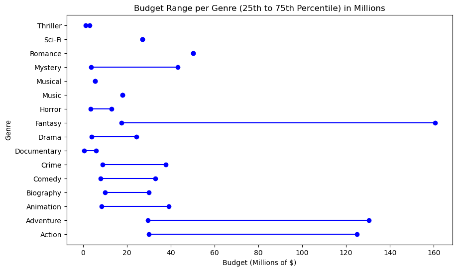

Runtime Correlation with Success Metrics : This correlation matrix shows that runtime has a moderate positive correlation with audience engagement (number of votes, 0.43) and movie ratings (0.41), but runtime has a negligible or weak relationship with ROI (-0.059), suggesting that longer movies attract more votes but don’t necessarily lead to higher profitability.

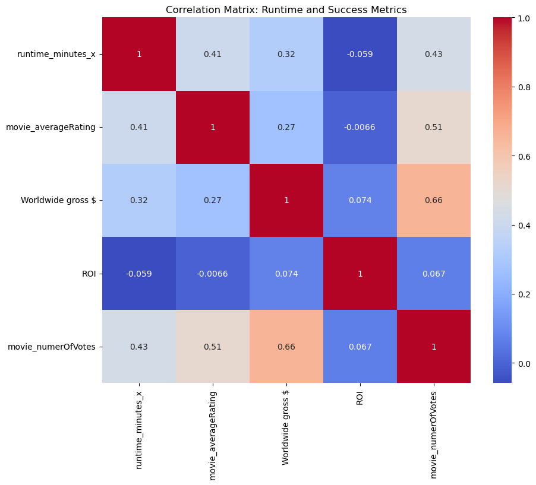

Runtime vs. Audience Engagement (Votes) : Longer movies tend to attract more audience engagement (measured by votes). 

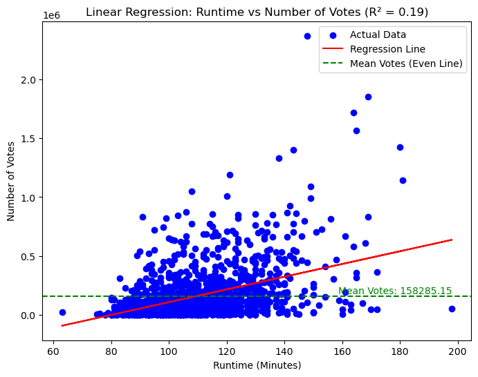

Average Revenue for Short vs. Long Runtime : Movies with longer runtimes generate more revenue, likely due to their association with bigger, more expensive productions. However, these films are not always more profitable in terms of ROI.

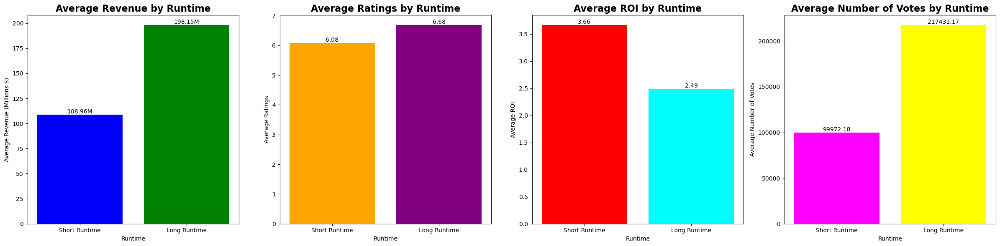

## Conclusions

- **Most Profitable Genres**:  
 Genres like Horror and Thriller deliver higher ROI with lower production costs, making them ideal for profitability. Genres like Horror and Thriller are safer, low-budget investments that often yield higher ROI.

- **Impact of Budget on Success Metrics**:  
 High-budget movies such as Action and Sci-Fi generate more revenue but do not always result in better ROI. For studios with limited resources, low-budget films can be safer investments. Action and Fantasy films tend to generate significant box-office revenue, making them ideal for larger investments.

- **Runtime and Audience Engagement**:  
 Runtime should be targeted by genre, but a sweet spot is generally recommended between 100-115 minutes, as they are long enough to develop a comprehensive storyline without risking audience fatigue.

### **Overall Stragic Enhancements**

- **Balanced Genre Strategy**: 
The studio should focus on a mix of high-revenue genres like Action and low-budget, high-ROI genres like Horror.

- **Tailored Production Budget Allocation**: 
Mid-budget films (around $40M–$70M) in genres like Comedy and Drama offer a balance between risk and profitability, making them ideal for maximizing returns.

- **Optimized Movie Length**: 
Prioritize movies with runtimes of 100 to 115 minutes to maximize audience engagement and ratings.

### Next Steps

- **Director Influence on ROI**:  
 Explore how directors' past performances impact ROI.

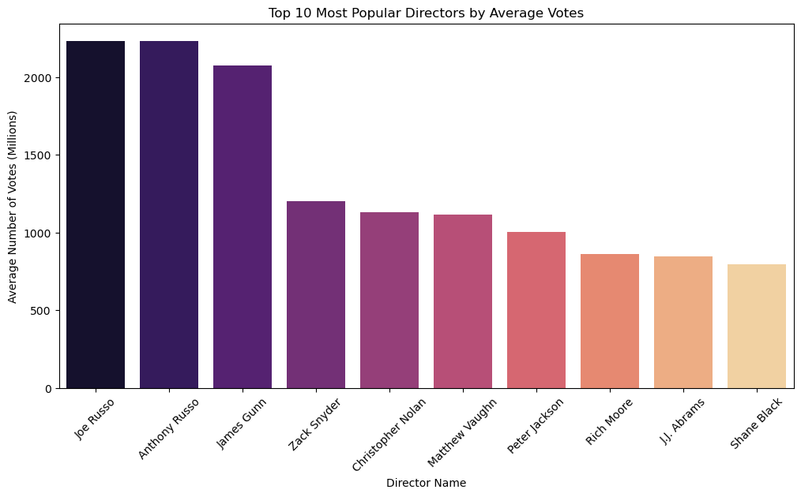

- **Awards and Success Metrics**:  
 Investigate how winning awards affects movie ratings and long-term profitability.

- **Trends in Genre Popularity**:  
  Study how genre preferences shift over time and predict future trends in audience demand.

## For More Information

See the full analysis in the [Jupyter Notebook](https://github.com/Jeesoo-Jhun/Phase-2-Project-Jeesoo/blob/main/notebooks/(final)%20clean%20notebook.ipynb) or review this [presentation](https://github.com/Jeesoo-Jhun/Phase-2-Project-Jeesoo/blob/main/presentation/presenatation.pdf)

[Tableau Dashboard link ](https://public.tableau.com/views/JSPhase2Project_1/Dashboard2?:language=en-US&publish=yes&:sid=&:redirect=auth&:display_count=n&:origin=viz_share_link)

[Original data source from Kaggle](https://www.kaggle.com/datasets/alessandrolobello/the-ultimate-film-statistics-dataset-for-ml/data)

## Repository Structure 

```
├── dashboard
├── images
├── notebooks
├── presentation
├── zippedData
├── .gitignore